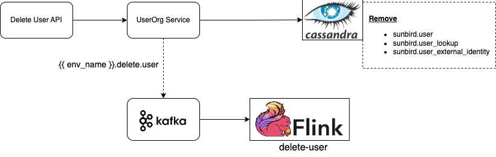

# Component Diagram

<figure><figcaption></figcaption></figure>

The Program User Info service is constructed upon the framework of Flink, Kafka and Cassandra, a powerful approach for processing and managing data in a scalable and real-time manner.

1. **Apache Kafka** is a distributed event streaming platform that is designed for handling high volumes of real-time data. In this service Kafka produces user information as an event of type JSON.
2. **Apache Flink** is a stream processing framework that provides high-throughput, low-latency, and exactly-once processing of streaming data. Flink consumes the event from Kafka and flattens the JSON. This process involves taking nested JSON structures and transforming them into a simpler, one-level structure where all the fields are at the top level.
3. **Apache Cassandra** is a distributed NoSQL database that is designed to handle massive amounts of data across many commodity servers, ensuring high availability and fault tolerance. Once the data is flattened it will be stored in Cassandra database.

**Configuration variables:**

<table><thead><tr><th width="246">Variable</th><th>Default Value</th><th>Purpose</th></tr></thead><tbody><tr><td>kafka.input.topic</td><td>{{env}}.programuser.info</td><td>Kafka topic from which messages/events are read to be processed.</td></tr><tr><td>kafka.groupId</td><td>{{env}}-programuser-group</td><td>Kafka input topic group Id</td></tr><tr><td>ml-cassandra.keyspace</td><td>sunbird_programs</td><td>Cassandra keyspace name</td></tr><tr><td>ml-cassandra.table</td><td>program_enrollment</td><td>Cassandra table used to store user data</td></tr></tbody></table>
