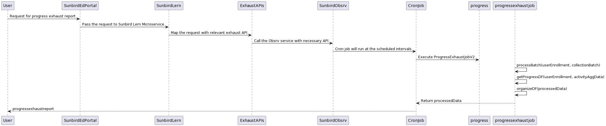

# Progress Exhaust

Progress exhaust contains the progress-related information for the collection and the nested collections including the assessment-related scores of the collection. The nested collections and the assessments within the collection will be transposed as columns and hence the columns for each collection exhaust file would vary

<figure><figcaption></figcaption></figure>

**Data Provider:**\
\
**cassandra**

1. user table
2. user\_enrolments
3. assessment\_aggregator
4. user\_activity\_agg

**postgres**

1. job\_request table

**Content search API**\
\
**File Structure**

| **Format** | **Nomenclature**                                 | **Example**                                                      |
| ---------- | ------------------------------------------------ | ---------------------------------------------------------------- |
| **CSV**    | _**\<batch\_id>\_progress\_\<updatedDate>.csv**_ | _**do\_1130264512015646721166\_\_progress\_\_26\_08\_2020.csv**_ |

#### File Contents <a href="#file-contents" id="file-contents"></a>

| **Column Label**                     | **Column Type** | **Data Type** | **Description**                                                                                                                                                                                |
| ------------------------------------ | --------------- | ------------- | ---------------------------------------------------------------------------------------------------------------------------------------------------------------------------------------------- |
| Collection Id                        | Static          | String        | Id of the collection.                                                                                                                                                                          |
| Collection Name                      | Static          | String        | Collection Title                                                                                                                                                                               |
| Batch Id                             | Static          | String        | Batch Id                                                                                                                                                                                       |
| Batch Name                           | Static          | String        | Batch Title                                                                                                                                                                                    |
| User UUID                            | Static          | String        | The system generated DIKSHA unique user ID                                                                                                                                                     |
| User Name                            | Static          | String        | Name of the user                                                                                                                                                                               |
| State                                | Static          | String        | User declared state for self signed up users. If the user is a state validated user then the state as passed from state SSO or derived from school ID.                                         |
| District                             | Static          | String        | User declared district for self signed up users. If the user is a state validated user then the district as passed from state SSO or derived from school ID.                                   |
| Enrolment Date                       | Static          | Date          | Collection enrolment date (for nested courses/collections it will be the parent collection enrolment date)                                                                                     |
| Completion Date                      | Static          | Date          | Collection completion date (for nested courses/collections it will be the parent collection completion date)                                                                                   |
| Progress                             | Static          | Number        | Collection progress (for nested courses/collections this will be the parent collection progress)                                                                                               |
| Certificate Status                   | Static          | String        | Issued - if the certificate is issued. Blank - if it is not issued and. Failed - if issue has failed                                                                                           |
| Total Score                          | Static          | Number        | Total Score received by the user across all assessments within the collection with category type as “SelfAssess”                                                                               |
| \<nested\_collection\_id> - Progress | Dynamic         | Number        | User’s progress at a nested collection level. This is a dynamic column. For ex: If there are 3 nested trackable collections within the parent collection there will be 3 corresponding columns |
| \<nested\_collection\_id> - Level    | Dynamic         | String        | The collection level within the parent collection for this specific collection id. Format would be like “1.1“, “2.1”, “3.1.2” etc.                                                             |
| \<assessment\_id> - Score            | Dynamic         | Number        | User’s best attempt for the given assessment id. This is a dynamic column. For ex: If there are 3 assessments within the parent collection there will be 3 corresponding columns               |

#### Sample Data <a href="#sample-data" id="sample-data"></a>

```csv
Collection Id,Collection Name,Batch Id,Batch Name,User UUID,User Name,State,District,Enrolment Date,Completion Date,Progress,Certificate Status,Total Score,do_1130934418641469441813 - Progress,do_1130934418641469441813 - Level,do_1130934445218283521816 - Progress,do_1130934445218283521816 - Level,do_1130934418641469441786-score
do_1130934466492252161819,Test Course,0130934495109529602,Batch1,f703de4e-d47a-4adb-856c-de122e6a0b32,Mathew Pallan,"Kerala","Thrissur",2020-08-25 13:45:54:150+0000,2020-08-27 13:45:54:150+0000,100,"Issued",7,100,"1.1",100,"1.2",7
do_1130934466492252161819,Test Course,0130934495109529602,Batch1,587204af-41db-4313-b3ab-cf022d3055c6,Krishna Jampana,"Andhra Pradesh","Vizag",2020-08-25 02:15:58:691+0000,"",57,"",6,50,"1.1",60,"1.2",6
```

\
