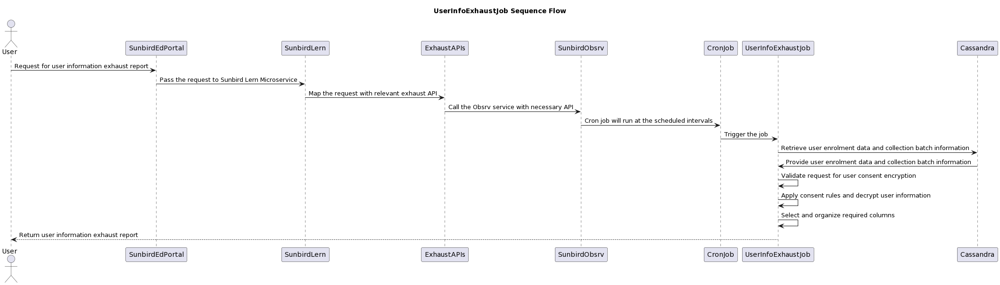

# User Info Exhaust

User personal info exhaust contains the additional information of the users that have joined the collection. The information contains personal details such as Email, Phone number etc and all such personal information is provided only with explicit consent by the user. Each record represents user details of the enrolled users in the course batch.Mail id and phone number are encrypted and will be decrypted based on consent

<figure><figcaption></figcaption></figure>

The UserInfoExhaustJob processes the data, applies consent rules, decrypts user information, and generates a user information exhaust report based on the provided user enrolment data and collection batch information.\
\
**Data provider:**\
**cassandra**

1. user table
2. user\_enrolments
3. user\_consent

**postgres**

1. job\_request table

\
\
**File Structure**

| **Format**                       | **Nomenclature**                                 | **Example**                                                  |
| -------------------------------- | ------------------------------------------------ | ------------------------------------------------------------ |
| **CSV zip (Password protected)** | _**\<batch\_id>\_userinfo\_\<updatedDate>.zip**_ | _**do\_1130264512015646721166\_userinfo\_26\_08\_2020.zip**_ |

#### File Contents <a href="#file-contents.1" id="file-contents.1"></a>

| **Column Label** | **Column Type** | **Data Type** | **Description** |
| ---------------- | --------------- | ------------- | --------------- |

| **Column Label**      | **Column Type** | **Data Type** | **Description**                                                                                                                                              |
| --------------------- | --------------- | ------------- | ------------------------------------------------------------------------------------------------------------------------------------------------------------ |
| Collection Id         | Static          | String        | Id of the collection.                                                                                                                                        |
| Collection Name       | Static          | String        | Collection Title                                                                                                                                             |
| Batch Id              | Static          | String        | Batch Id                                                                                                                                                     |
| Batch Name            | Static          | String        | Batch Title                                                                                                                                                  |
| User UUID             | Static          | String        | The system generated DIKSHA unique user ID                                                                                                                   |
| User Name             | Static          | String        | Name of the user                                                                                                                                             |
| State                 | Static          | String        | User declared state for self signed up users. If the user is a state validated user then the state as passed from state SSO or derived from school ID.       |
| District              | Static          | String        | User declared district for self signed up users. If the user is a state validated user then the district as passed from state SSO or derived from school ID. |
| Org Name              | Static          | String        | Name of user org - DIKSHA Custodian for self signed up users and respective tenant names for state validated users                                           |
| External ID           | Static          | Number        | Self declared users this is their declared ID. For state validated users this is their Teacher ID                                                            |
| School Id             | Static          | String        | If user is state validated teacher then the school ID mapped to this user. If user is self declared user then the user declared school ID.                   |
| School Name           | Static          | String        | If user is state validated teacher then the school name mapped to this user. If user is self declared user then the user declared org/school name.           |
| Block Name            | Static          | String        | Block name mapped to the user’s org/school id                                                                                                                |
| Declared Board        | Static          | String        | The board selected by the user during onboarding.                                                                                                            |
| Declared Org          | Static          | String        | If the user is a self signed up user then this is the value filled by the user in the 'With' part of the self signed up declaration.                         |
| Mobile Number         | Static          | String        | User declared unmasked mobile number                                                                                                                         |
| Email ID              | Static          | String        | User declared unmasked email ID                                                                                                                              |
| Consent Provided      | Static          | String        | Yes/No. Flag to denote whether user has consented to the data sharing.                                                                                       |
| Consent Provided Date | Static          | Date          | Date when the user has consented to share the data                                                                                                           |

#### Consent Fields <a href="#consent-fields" id="consent-fields"></a>

Following are the fields/columns that will be available in the file only when the user consented for the data sharing.

| External ID   |
| ------------- |
| School ID     |
| School Name   |
| Block Name    |
| Mobile number |
| Email ID      |

**Sample Data**

```csv
Collection Id,Collection Name,Batch Id,Batch Name,User UUID,User Name,User Type,User Sub Type,State,District,Block,Cluster,School Id,School Name,Org Name,Email ID,Mobile Number,Consent Provided,Consent Provided Date
do_21364005085239705611078,Copy of course with merit cert testing,BatchId_01364005724219801651,batch123,91a81041-bbbd-4bd7-947f-09f9e469213c,newtncr,administrator,"hm,asst_als_coordinator,meo",Andhra Pradesh,EAST GODAVARI,ADDATEEGALA,"",28140306106,APTWRS ADDATEEGALA,DR B R OMNI INTERNATIONAL2,newtncr@yopmail.com,"",true,06/10/2022
do_21364005085239705611078,Copy of course with merit cert testing,BatchId_01364005724219801651,batch123,2f97ee31-c190-4adc-8ca1-129f641858e2,bgm,administrator,"chm,meo,diet_lecturer,lib_bdc",Andhra Pradesh,ANANTAPUR,AGALI,"",28226200605,MPPS P.BYADAGERA,Staging Custodian Organization,bgm@yopmail.com,"",true,06/10/2022// Some code
```
