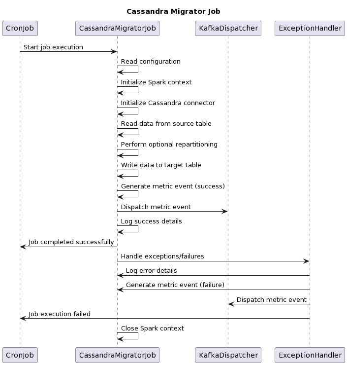

# Cassandra migrator Job

The Cassandra migrator job performs the data migration from one Cassandra table to another. It reads data from a source table specified in the configuration, performs optional repartitioning based on provided columns, and writes the data to a target table using the Cassandra connector. After the migration is completed successfully, the code generates a metric event with information about the migration, such as the total number of records migrated and the time taken. This metric event is dispatched to a Kafka topic if the configuration allows it. In case of an exception or failure during the migration process, appropriate error handling is performed. The error is logged, and a metric event indicating the failure is generated and dispatched to the Kafka topic if configured.

**Data provider:**

**Cassandra**

1. user\_enrolments

<figure><figcaption></figcaption></figure>

\
\
