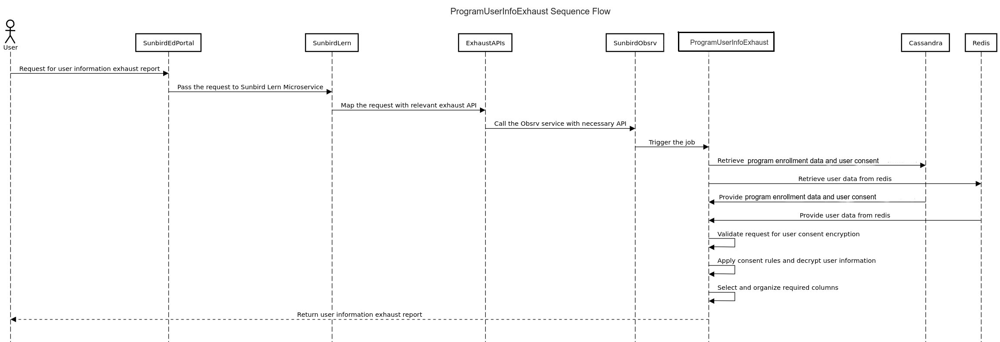

# Program Exhaust

Program user personal info exhaust contains the additional information of the users that have joined the program. The information contains personal details such as Email, Phone number and Username all such personal information is provided only with explicit consent by the user. Each record represents user details of the enrolled users in the program.Mail id ,Username and phone number are encrypted and will be decrypted based on consent

<figure><figcaption></figcaption></figure>

The ProgramUserInfoExhaustJob processes the data, applies consent rules, decrypts user information, and generates a program user information exhaust report based on the provided program enrolment data and user consent.The encryption key is mandatory only for program user info exhaust\
\
**Data provider:**\
**cassandra**

1. program\_enrolment
2. user\_consent

**Redis**

1. user


**postgres**

1. job\_request table

**File Structure**

<table data-header-hidden><thead><tr><th></th><th width="286.3333333333333"></th><th></th><th></th></tr></thead><tbody><tr><td><strong>Format</strong></td><td><strong>Nomenclature</strong></td><td><strong>Example</strong></td><td><strong>Security Levels</strong></td></tr><tr><td><strong>CSV zip (Password protected)</strong></td><td><strong>program-user-exhaust/&#x3C;request_id>_&#x3C;UpdatedDate>.zip</strong></td><td><strong>9CD107F48B5AF0D163F8AE8410829674_20230622.zip</strong></td><td><strong>L3 - Data encrypted with a user provided encryption key. Generally applicable to non PII data but can contain sensitive information which may not be considered open</strong></td></tr></tbody></table>

#### File Contents <a href="#file-contents" id="file-contents"></a>

<table data-header-hidden><thead><tr><th width="260"></th><th></th><th></th><th></th></tr></thead><tbody><tr><td><strong>Column Label</strong></td><td><strong>Column Type</strong></td><td><strong>Data Type</strong></td><td><strong>Description</strong></td></tr><tr><td>User UUID</td><td>Static</td><td>String</td><td>The system generated unique user ID</td></tr><tr><td>User Name</td><td>Static</td><td>String</td><td>Name of the user(Firstname and Lastname)</td></tr><tr><td>Mobile Number</td><td>Static</td><td>String</td><td>User declared unmasked mobile number</td></tr><tr><td>Email ID</td><td>Static</td><td>String</td><td>User declared unmasked email ID</td></tr><tr><td>Consent Provided</td><td>Static</td><td>String</td><td>Yes/No. Flag to denote whether user has consented to the data sharing.</td></tr><tr><td>Consent Provided Date</td><td>Static</td><td>Date</td><td>Date when the user has consented to share the data</td></tr><tr><td>Program Name</td><td>Static</td><td>String</td><td>Program title</td></tr><tr><td>Program ID</td><td>Static</td><td>String</td><td>Unique Program Identifier.</td></tr><tr><td>State</td><td>Static</td><td>String</td><td>User declared state for self signed up users. If the user is a org validated user then the state as passed from org SSO or derived from sub-org ID.</td></tr><tr><td>District</td><td>Static</td><td>String</td><td>User declared district for self signed up users. If the user is a org validated user then the district as passed from org SSO or derived from sub-org ID.</td></tr><tr><td>Block</td><td>Static</td><td>String</td><td>Block name mapped to the user’s org/sub-org id</td></tr><tr><td>Cluster</td><td>Static</td><td>String</td><td>Cluster name mapped to the user’s org/sub-org id</td></tr><tr><td>School Id</td><td>Static</td><td>String</td><td>User declared school id for self signed up users. If the user is a org validated user then the school id as passed from org SSO or derived from sub-org ID</td></tr><tr><td>School Name</td><td>Static</td><td>String</td><td>School name mapped to the user’s org/sub-org id</td></tr><tr><td>User Type</td><td>Static</td><td>String</td><td>Type of the user</td></tr><tr><td>User Sub Type</td><td>Static</td><td>String</td><td>Sub Type of the user</td></tr><tr><td>Org Name</td><td>Static</td><td>String</td><td>Name of user org - Custodian for self signed up users and respective org name for org validated users</td></tr></tbody></table>

#### Consent Fields <a href="#consent-fields" id="consent-fields"></a>

Following are the fields/columns that will be available in the file only when the user consented for the data sharing.

| User Name     |
| ------------- |
| Mobile number |
| Email ID      |

**Sample Data**

```csv
User UUID,User Name(On user consent),Mobile number(On user consent),Email ID(On user consent),Consent Provided,Consent Provided Date,Program Name,Program ID,State,District,Block,Cluster,School Id,School Name,Usertype,Usersubtype,Org Name
ef3733df-41e7-4bf1-b67c-091fd0762eea,opa5,7272272777,pao@test.com,false,01/01/23,'Prerak Head Teacher of the Block 19-20',PGM-Prerak-Head-Teacher-of-the-Block-19-20-Feb2021,Uttar Pradesh,AGRA,ACHHNERA,ZPHS AGALI,9150206302,JHS NAGLA SADLE COMPOSITE,administrator,hm,dikshapreprodcustodian
2cbe278b-90ba-4680-a632-654add16be8c,'oap5 ',8892892810,oap@test.com,true,01/01/2023,'Prerak Head Teacher of the Block 19-20',PGM-Prerak-Head-Teacher-of-the-Block-19-20-Feb2021,Uttar Pradesh,AMETHI,AMETHI,ZPHS AGALI,9730200601,PS UMAPUR GANAPATTI,administrator,diet_pricipal,dikshapreprodcustodian
```
