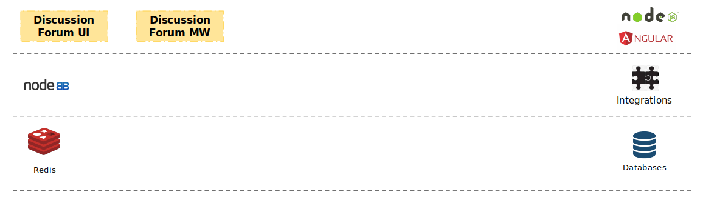
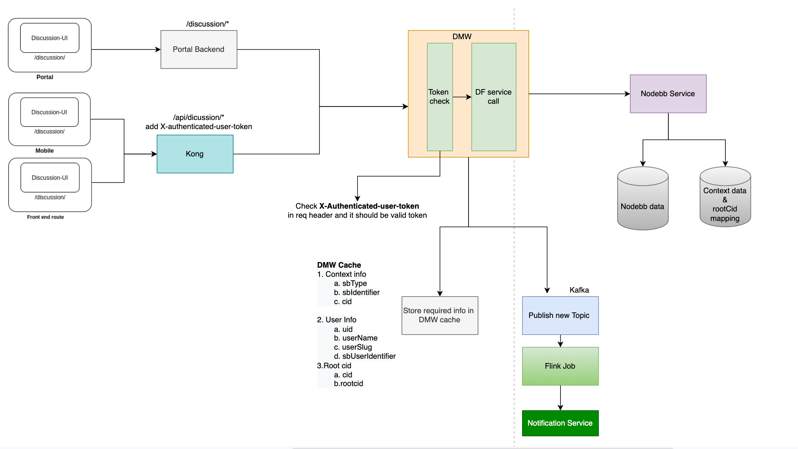

# Architecture

### Architecture Diagram 

The above architecture Diagram shows, How we are integrating the discussion forum with sunbird-portal/Mobile app along with notification service. Once the request fired we are validating the request and the forwarded to DMW for there to Nodebb service. There are some action where we need to notify the users, For that we are integrated notification service. The actions are listed below.

* On Topic creation.
* On Topic reply.
* On Topic/Post upvote or downvote.

#### Code Structure

* [Repository](../../../../use/developer-guide/discussion-forum/developer-installation/source-code.md)
*   Important Folder / Package structure

    <pre><code><strong>- projects
    </strong>	- discussion-ui: 
    	- src: 
    </code></pre>

