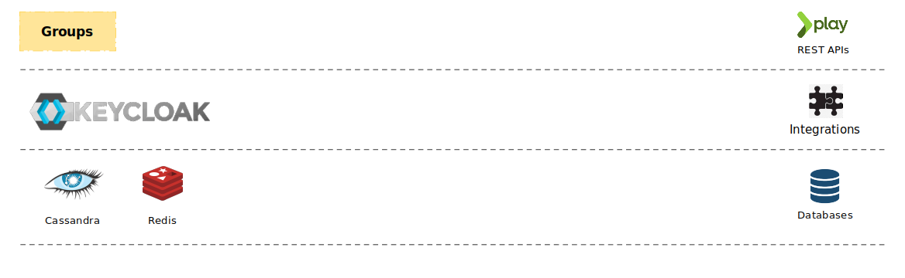

# Architecture

#### **Architecture Diagram**

***

 (1).png>)

1. **CRUD** operations are managed by **Group Service**.
2. From Group Service If the API is related to the **user/member** then the **Learner Service** is called to get the user details.
3. Notifications are created by Notification Service for some action in groups (eg: Group Created).
4. **Content Service** is \*\*\*\* used to get all the results based on the Search Query.
5. **Cassandra Databas**_**e**_ is used to do all the CRUD operations.
6. All the Telemetry Data are stored in **Kafka**
