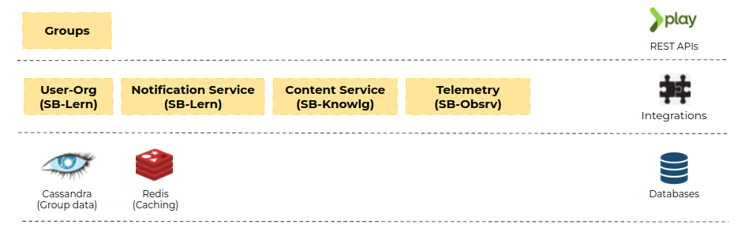

# Architecture

#### **Architecture Diagram**

<figure><figcaption></figcaption></figure>

#### Flow Diagram

<figure><figcaption></figcaption></figure>

#### Code Flow Diagram

<figure><figcaption></figcaption></figure>

* Group service provide CRUD operations for group management.
* This service is integrated with UserOrg service to fetch group member data. So APIs which handle group member details uses UserOrg service. System settings like custodian organisation id or default organisation id is fetched from UserOrg. Organisation details are read using Org read API from UserOrg.
* Most of the group CRUD operations generate notifications to users using Notification Service (eg: Group Created)
* Content Service is used to search the activity details with respect to the activity type and id using activityConfig.json.
* Cassandra is the primary data store and Redis is used for caching the group data.
* Every API call generates telemetry and with the help of logstash-logback, this telemetry is updated to "${ENV\_NAME}.telemetry.raw" Kafka topic. Datapipeline of Sunbird-Obsrv process this telemetry for various data operations.

