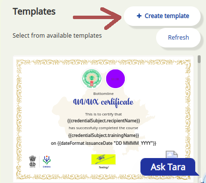
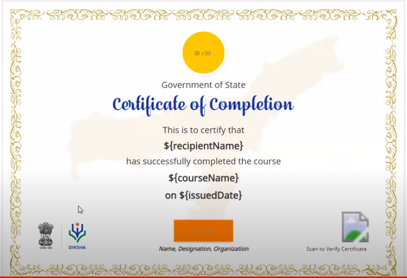
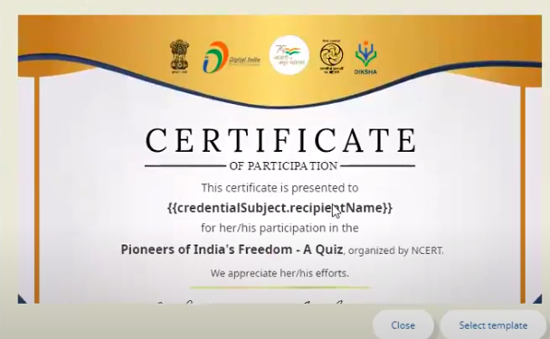
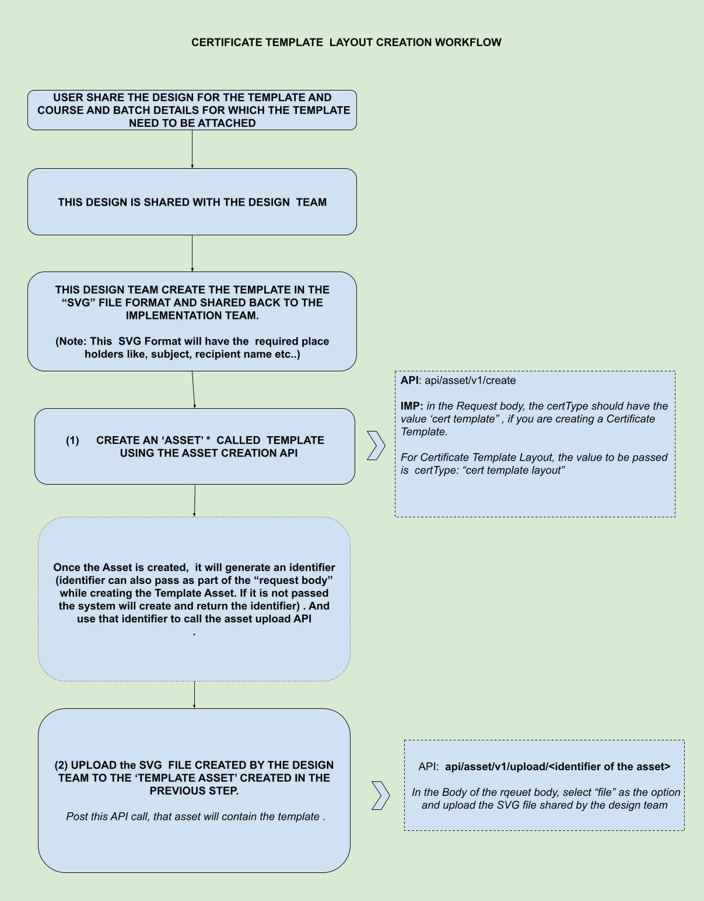

# Certificates Creation and Configuration

**API Used:** \
\
\{{host\}}/api/asset/v1/create \{{host\}}/api/asset/v1/upload \{{host\}}/api/asset/v1/update \{{host\}}/api/course/batch/cert/v1/template/add \{{host\}}/api/course/batch/cert/v1/template/remove http://docs.sunbird.org/latest/apis/assetapi/ http://docs.sunbird.org/latest/apis/coursebatchcertificateapi/index.html http://docs.sunbird.org/latest/apis/coursebatchmanapi/\
\
**Introduction:** \
\
In Sunbird, a ‘Certificate’ can be attached to any course/batch, which will then be issued to a user on completion of the course/batch. The ‘certificate’ workflow in Sunbird involves creating certificate template(s) or template layout(s) and attaching them with the course batch so that a certificate gets issued based on the template selected. Certificates in Sunbird have the following features.\
\
a. Certificate can be attached to a specific Course Batch. \
b. Certificate templates can be configured from the back end for a specific tenant. \
c. Once configured(as in #b), the Course creator/mentor can attach a certificate to a batch via the option available in the portal.\
d. Rules for issuing certificates can be configured via the option available in the portal.\
e. Sunbird allows you to create both “certificate template layout” and “Certificate.\
\
**Certificate Templates:** \
\
In order to attach a certificate to any course batch, ‘certificate templates’ need to be created / present in the system for that particular channel. Certificate templates are basically a model of the actual certificate which consists of specific designs and variables.

<figure><figcaption></figcaption></figure>

Certificates can be configured for a tenant in two ways: \
a) Configure generic “cert template layout” \
b) Configure “cert template”\
\
**Certificate Template Layout** \
\
“Cert template layout” is an SVG file with placeholders for logo and signature image along with other variables - course name, user’s name and date of issue. Once configured, this SVG file becomes a layout for creating multiple “cert template” by adding logos and signature images in the placeholders via the Sunbird portal(at the time of Creating the Batch for a course).

<div align="left">

<figure><figcaption></figcaption></figure>

 

<figure><figcaption></figcaption></figure>

</div>

Once the “cert templates” are generated using layouts, “cert templates” can be attached to course batches and the certificate will be generated as per the chosen templates. We have four types of “cert template layout” available for Sunbird currently,

* SVG file with a placeholder for 1 logo and 1 signature image
* SVG file with a placeholder for 2 logos and 1 signature image
* SVG file with a placeholder for 1 logo and 2 signature images
* SVG file with a placeholder for 2 logos and 2 signature images

**Certificate Template:**\
\
“Cert template” is an SVG file which doesn't have any placeholders (like Logo and Signatures as in the case of Certificate Template Layout) for template modifications. It is a fixed template (with variables for course name, user’s name and date of issue). These can be generated using “cert template layout” via application or created directly using certificate APIs. Once created it can be directly attached to course batches. In the Sunbird context, each certificate template is an asset and has the below attributes:

| Property        | Description                                                                                                                                                                | Eg.                                                                                                                                                                       |
| --------------- | -------------------------------------------------------------------------------------------------------------------------------------------------------------------------- | ------------------------------------------------------------------------------------------------------------------------------------------------------------------------- |
| certType        | <p></p><p>certType represents the type of the certificate.Following are the two available types: template"</p><ol><li>cert template layout</li><li>cert template</li></ol> | <p>"certType": "cert template.<br>"certType": "cert template layout"</p>                                                                                                  |
| code            | Represents the code value of asset                                                                                                                                         | "code": "CertificateOfCompletion"                                                                                                                                         |
| channel         | Represents the channel value of the asset to which it belongs                                                                                                              | "channel":"0126825293972439041"                                                                                                                                           |
| name            | Represents the name of the certificate asset                                                                                                                               | "name": "Certificate of Completion"                                                                                                                                       |
| identifier      | Represents the unique id of the certificate asset                                                                                                                          | "identifier": "do\_21341213974781952 01161"                                                                                                                               |
| mimeType        | Represents the mime type of the asset, i.e.,‘image/svg+xml’ in case of certificates                                                                                        | "mimeType":"image/svg+xml"                                                                                                                                                |
| license         | Represents the licensing of the certificate asset                                                                                                                          | "license": "CC BY 4.0"                                                                                                                                                    |
| primaryCategory | Represents the primary category of the asset                                                                                                                               | "primaryCategory": "Certificate Template"                                                                                                                                 |
| mediaType       | Represents media type of asset, i.e., ‘image’ in case of certificates                                                                                                      | "mediaType": "image"                                                                                                                                                      |
| issuer          | Represents the details about certificate issuing organisations. It can be a state or non-state tenant.                                                                     | "issuer": {"name": "mp","url": "https://Sunbird.gov. in/mp/"}                                                                                                             |
| signatory list  | Represents the details about the signatory authority                                                                                                                       | "issuer": { "name": "/name of signatory/", "image": "/base64 encoded png image of signature/", "id": "/id of signatory/", "designation": "/designation of signatory/" } " |


**Certificate Creation Workflow in Sunbird:**\
&#x20;\
As mentioned in the previous sections, the Certificate Template Creation request can be, to create either a “Certificate Template” or “Certificate Template Layout”

|                                                                                                               |                                                                                                |
| ------------------------------------------------------------------------------------------------------------- | ---------------------------------------------------------------------------------------------- |
| Certificate Template Layout, where the user can change the logo, signature etc.. via UI(ie. Portal interface) | Certificate Template, where the user cannot change any parameters via UI(ie. Portal Interface) |

<div>

<figure><figcaption></figcaption></figure>

 

<figure><figcaption></figcaption></figure>

</div>

Steps to Configure a “cert template layout”

1. Configure or validate the certificate rule preference for the tenant.
2. Create an asset with certType as a ‘cert template layout’ for the tenant.
3. Upload the “cert template layout” SVG file to that asset.
4. “cert template” can be created by a course creator in the application using one of the layouts and then the same can be attached to a course-batch

The following diagram explains the certificate template layout creation process:

<figure><figcaption></figcaption></figure>

**APIs and Steps to Create Certificate Templates Layout:**

<details>

<summary>Steps</summary>

**(a) Tenant Preference Read API:** \
\
Certificates generally will have certain rules/’criteria’ by which it gets issued to a user. Eg. We can say that a certificate is issued after the completion of a course/batch. We can also set rules that says, to issue certificates only if the user scores above certain “Scores” in the assessment. This rule can be set using the “Tenant Preference” APIS. \
\
Following API can be used for reading/validating certificate rule preference for the tenant


```
curl --location --request POST '{{host}}/api/org/v2/preferences/read' \
--header 'x-authenticated-user-token: {{auth_user_token}}'\
--header 'Authorization: Bearer {{api_key}}' \
--header 'Content-Type: application/json' \
--data-raw '{
"request": {
"orgId": "{{orgId}}",
"key": "certRules"
}
}'
```


**(b) Tenant Preference Create API:**\
\
Following APIs is used to create the certificate Rule/Criteria preference for the tenant

```
curl --location --request POST '{{host}}/api/org/v2/preferences/create' \
--header 'x-authenticated-user-token: {{auth_user_token}}'\--header 'Authorization: Bearer {{api_key}}' \
--header 'Content-Type: application/json' \
--data-raw '{
"request": {
"orgId": "{{orgId}}",
"key": "certRules",
"data": {
"templateName": "certRules",
"action": "save",
"fields": [
{
"code": "certTypes",
"dataType": "text",
"name": "certTypes",
"label": "Certificate type",
"description": "Select certificate",
"editable": true,
"inputType": "select",
"required": true,
"displayProperty": "Editable",
"visible": true,
"renderingHints": {
"fieldColumnWidth": "twelve"
},
"range": [
{
"name": "Completion certificate",
"value": {
"enrollment": {
"status": 2
}
}},
{
"name": "Merit certificate",
"value": {
"score": ">= 98"
}
}
],
"index": 1
},
{
"code": "issueTo",
"dataType": "text",
"name": "issueTo",
"label": "Issue certificate to",
"description": "Select",
"editable": true,
"inputType": "select",
"required": true,
"displayProperty": "Editable",
"visible": true,
"renderingHints": {
"fieldColumnWidth": "twelve"
},
"range": [
{
"name": "All",
"value": {
"user": {
"rootOrgId": ""
}
}},
{
"name": "My Org User",
"rootOrgId": "{{orgId}}"
}
],
"index": 2
}
]
}
}
}'
```

**(c) Certificate Asset APIs:**\
Create an ‘ASSET” type of “Certificate” \
Following APIs are used to create the certificate template layout,

```
curl --location --request POST '{{host}}/api/asset/v1/create' \
--header 'x-authenticated-user-token: {{auth_user_Token}}' \
--header 'Authorization: Bearer {{api_key}}' \
--header 'Content-Type: application/json' \
--header 'X-Channel-ID: {{orgId}}'\
--data-raw '{
"request": {
"asset": {
“channel”: “CHANNEL_ID”
"identifier": "SVG_TEMPLATE_LAYOUT_ID",
"name": "SVG_TEMPLATE_LAYOUT_NAME",
"code": "SVG_TEMPLATE_LAYOUT_NAME",
"mimeType": "image/svg+xml",
"license": "CC BY 4.0",
"primaryCategory": "Certificate Template",
"mediaType": "image",
"certType": "cert template layout",
"data": {
"title": "SVG_TEMPLATE_NAME"
}
}
}
}'
```

**(d) Asset Upload APIs:**\
Once the asset is created, upload the certificate design(ie. SVG file) created for this template.

```
curl --location --request POST '{{host}}/api/asset/v1/upload/SVG_TEMPLATE_LAYOUT_ID' \
--header 'Content-Type: multipart/form-data' \
--header 'Authorization: Bearer {{api_key}}' \
--header 'x-authenticated-user-token: {{auth_user_token}}' \
--header 'X-Channel-ID: {{orgId}}' \
--form 'file=@"/C:/Users/Downloads/SVG_TEMPLATE_LAYOUT_ID.svg"'
```

**(e) Asset Read APIs:**\
Once the asset is created and uploaded, the following APIs is used to verify this asset(ie. Template)

```
curl --location --request GET '{{host}}/api/asset/v1/read/{{SVG_TEMPLATE_LAYOUT_ID}}' \
--header 'Content-Type: application/json' \
--header 'Authorization: Bearer {{api_key}}'
```

**Steps to Configure a “cert template”:**\
\
Please follow tenant preference creation, read process APIs mentioned in the above steps. The only change, in this case, is , while calling the ‘asset/create’ API pass, ‘certType’ as “cert template” instead of ‘cert template layout’.\
\
Following API used to create the ‘Asset’ called ‘Cert Template’.

```
curl --location --request POST '{{host}}/api/asset/v1/create' \
--header 'Content-Type: application/json' \
--header 'Authorization: {{api_key}}' \
--header 'x-authenticated-user-token: {{auth_user_token}}' \
--header 'X-Channel-ID: {{orgId}}' \
--data-raw '{
"request": {
"asset": {
"channel": "CHANNEL_ID",
"name": "SVG_TEMPLATE_NAME",
"identifier": "SVG_TEMPLATE_ID",
"code": "SVG_TEMPLATE_ID",
"mimeType": "image/svg+xml",
"license": "CC BY 4.0",
"primaryCategory": "Certificate Template",
"mediaType": "image",
"certType": "cert template",
"data": {
"title": "SVG_TEMPLATE_NAME"
},
"issuer": {
"name": "",
"url": ""
},
"signatoryList": []
}
}
}'
```

**Note:** Once created the “Cert Template”, please follow the steps mentioned above steps to upload the SVG files and follow the subsequent steps.

</details>

#### Frequently Asked Questions

<details>

<summary>FAQ's</summary>

**Q1. How to Update the Certificate Template / Certificate Template Layout once created?**\
\
● To update the SVG template of the existing cert template or cert template layout use the ‘Asset Upload API’ and just upload the new template file with the API request. \
● To update any specific details in the certificate template used ‘Asset Update API.\
\
Following API used to update the template/template layout

```
curl --location --request PATCH '{{host}}/api/asset/v1/update' \
--header 'Content-Type: application/json' \
--header 'Authorization: {{api_key}}' \
--header 'x-authenticated-user-token: {{auth_user_token}}' \
--header 'X-Channel-ID: {{orgId}}' \
--data-raw '{
"request": {
"asset": {
"channel": "{{CHANNEL_ID}}",
"versionKey": "{{VERSION_KEY_OF_EXISTING_TEMPLATE}}"
}
}
}'
```

**IMP:** Please note to get the version key of the certificate template please use the ‘Asset Read’ api\
\
**Q2. How to Add a Certificate Template to a Course Batch?**\
Certificate Templates Can be Added to the Batch using the Course Batch Apis

```
curl --location --request PATCH '{{host}}/api/course/batch/cert/v1/template/add' \
--header 'Content-Type: application/json' \
--header 'Authorization: Bearer {{api_key}}' \
--header 'x-authenticated-user-token: {{auth_user_token}}' \
--data-raw '{
"request": {
"batch": {
"batchId": "{{batchId}}",
"courseId": "{{courseId}}",
"template": {
"identifier": "SVG_TEMPLATE_ID",
"previewUrl": "{{cer_template_blob_path}}",
"criteria": {
"enrollment": {
"status": 2
}
},
"name": "SVG_TEMPLATE_ID",
"issuer": {
"name": "ORG NAME",
"url": "https://org_site.org"
},
"signatoryList": [
{
"image": "https://dummy.org","name": "Dummy",
"id": "dummy",
"designation": "dummy"
}
]
}
}
}
}'
```

**Q3. How can we Remove a Certificate Template from a Course Batch?**\
Certificate Templates Can be removed using the Course Batch Apis

```
curl --location --request PATCH '{{host}}/api/course/batch/cert/v1/template/remove' \
--header 'Content-Type: application/json' \
--header 'Authorization: Bearer {{api_key}}' \
--header 'x-authenticated-user-token: {{auth_user_token}}' \
--data-raw '{
"request": {
"batch": {
"batchId": "{{batchId}}",
"courseId": "{{courseId}}",
"template": {
"identifier": "{{SVG_TEMPLATE_ID}}"
}
}
}
}'
```

**Q4. How can I verify whether a certificate is attached to the course batch?**\
You can verify whether a certificate is attached to a batch by using the course batch read/list APIs

```
curl --location --request POST '{{host}}/learner/course/v1/batch/list' \
--header 'Content-Type: application/json' \
--header 'Authorization: Bearer {{api_key}}' \
--data-raw '{
"request": {
"filters": {
"batchId": "{{BATCH_ID}}"
}
}
}'
```

**Q5. Once the Certificate Template is Created using the APIs/ Backend, how can the course creator attach that certificate to his/her course batch?**\
Course Creator can log in and open the course, and use the option “Add/Edit Certificate” in the UI for the same.\
\
**Q6. Can the Certificate Template be attached to Course/Batch from the Backed via APIs?**\
Yes, once created, the Cert template or Cert Template Layout can be attached to the course batch via APIs.\
\
**Q7. Can I attach a different template to the course batch, if a template is already attached to the same course batch?**\
No, While attaching the ‘cert template’ to a course batch, we must ensure that there isn’t any existing ‘cert template’ attached to it using course/batch read API. If it is already then we need to remove that ‘cert template’ from that course batch using the ‘cert template remove’ API and then attach a new ‘cert template’\


</details>
