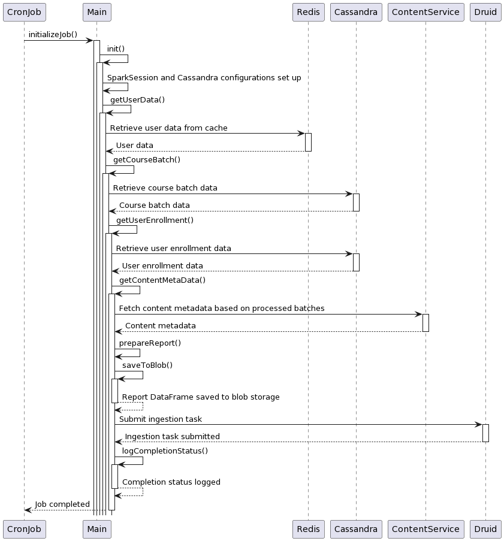

# Collection Summary Job

The 'Collection Summary Snapshot' data source in Druid serves as a repository for extracting metrics used in various reports. This Collection Summary Job captures information from user data and courses, saving it as a blob. The blob data is then indexed into the 'Collection Summary Snapshot' within Druid for further analysis and retrieval.


<div data-full-width="true">

<figure><figcaption></figcaption></figure>

</div>

**Data provider:**

**Cassandra**

1. user\_enrolments
2. course\_batch

**API**

1. Druid ingestion task trigger API
2. Content search API

<details>

<summary><strong>Collection Summary Ingestion Spec:</strong></summary>

```json
{
  "type": "index",
  "spec": {
    "dataSchema": {
      "dataSource": "collection-summary-snapshot",
      "parser": {
        "type": "string",
        "parseSpec": {
          "format": "json",
          "flattenSpec": {
            "useFieldDiscovery": false,
            "fields": [
              {
                "type": "root",
                "name": "content_org",
                "expr": "contentorg"
              },
              {
                "type": "root",
                "name": "user_org",
                "expr": "orgname"
              },
              {
                "type": "root",
                "name": "batch_start_date",
                "expr": "startdate"
              },
              {
                "type": "root",
                "name": "batch_end_date",
                "expr": "enddate"
              },
              {
                "type": "root",
                "name": "has_certificate",
                "expr": "hascertified"
              },
              {
                "type": "root",
                "name": "collection_id",
                "expr": "courseid"
              },
              {
                "type": "root",
                "name": "batch_id",
                "expr": "batchid"
              },
              {
                "type": "root",
                "name": "collection_name",
                "expr": "collectionname"
              },
              {
                "type": "root",
                "name": "batch_name",
                "expr": "batchname"
              },
              {
                "type": "root",
                "name": "total_enrolment",
                "expr": "enrolleduserscount"
              },
              {
                "type": "root",
                "name": "total_completion",
                "expr": "completionuserscount"
              },
              {
                "type": "root",
                "name": "total_certificates_issued",
                "expr": "certificateissuedcount"
              },
              {
                "type": "root",
                "name": "content_status",
                "expr": "contentstatus"
              },
              {
                "type": "root",
                "name": "user_state",
                "expr": "state"
              },
              {
                "type": "root",
                "name": "user_district",
                "expr": "district"
              },
              {
                "type": "root",
                "name": "content_channel",
                "expr": "channel"
              },
              {
                "type": "root",
                "name": "keywords",
                "expr": "keywords"
              },
              {
                "type": "root",
                "name": "timestamp",
                "expr": "timestamp"
              },
              {
                "type": "root",
                "name": "medium",
                "expr": "medium"
              },
              {
                "type": "root",
                "name": "subject",
                "expr": "subject"
              },
              {
                "type": "root",
                "name": "created_for",
                "expr": "createdfor"
              },
              {
                "type": "root",
                "name": "user_type",
                "expr": "usertype"
              },
              {
                "type": "root",
                "name": "user_subtype",
                "expr": "usersubtype"
              }
            ]
          },
          "dimensionsSpec": {
            "dimensions": [
              {
                "name": "content_org"
              },
              {
                "name": "user_org"
              },
              {
                "type": "string",
                "name": "batch_id"
              },
              {
                "type": "string",
                "name": "batch_start_date"
              },
              {
                "type": "string",
                "name": "batch_end_date"
              },
              {
                "type": "string",
                "name": "collection_id"
              },
              {
                "type": "string",
                "name": "collection_name"
              },
              {
                "type": "string",
                "name": "batch_name"
              },
              {
                "type": "long",
                "name": "total_enrolment"
              },
              {
                "type": "long",
                "name": "total_completion"
              },
              {
                "type": "long",
                "name": "total_certificates_issued"
              },
              {
                "type": "string",
                "name": "content_status"
              },
              {
                "type": "string",
                "name": "user_state"
              },
              {
                "type": "string",
                "name": "user_district"
              },
              {
                "name": "keywords"
              },
              {
                "name": "has_certificate"
              },
              {
                "type": "string",
                "name": "content_channel"
              },
              {
                "name": "medium"
              },
              {
                "name": "subject"
              },
              {
                "name": "created_for"
              },
              {
                "type": "string",
                "name": "user_type"
              },
              {
                "type": "string",
                "name": "user_subtype"
              }
            ],
            "dimensionsExclusions": []
          },
          "timestampSpec": {
            "column": "timestamp",
            "format": "auto"
          }
        }
      },
      "metricsSpec": [],
      "granularitySpec": {
        "type": "uniform",
        "segmentGranularity": "day",
        "queryGranularity": "none",
        "rollup": true
      }
    },
    "ioConfig": {
      "type": "index",
      "firehose": {
        "type": "static-azure-blobstore",
        "blobs": [
          {
            "container": "reports",
            "path": "/collection-summary-reports-v2/collection-summary-report-latest.json"
          }
        ],
        "fetchTimeout": 300000
      }
    },
    "tuningConfig": {
      "type": "index",
      "targetPartitionSize": 5000000,
      "maxRowsInMemory": 25000,
      "forceExtendableShardSpecs": false,
      "logParseExceptions": true
    }
  }
}
```

</details>

#### Collection Summary Snapshot Spec:

| **Dimension In Druid**      | **Column Label**       | **Data Type** | **Description**                                        |
| --------------------------- | ---------------------- | ------------- | ------------------------------------------------------ |
| batch\_id                   | batchid                | String        | Unique Batch Identifier                                |
| batch\_name                 | batchname              | String        | Name of the batch                                      |
| content\_channel            | channel                | String        | Name of the Channel                                    |
| collection\_org\_name       | organisation           | String        | Published By or Course Publisher Name or tenant        |
| collection\_id              | courseid               | String        | Unique Collection Identifier                           |
| collection\_name            | collectionname         | String        | Name of Course                                         |
| batch\_start\_date          | startdate              | String        | Start Date of the Batch                                |
| batch\_end\_date            | enddate                | String        | End Date of the Batch                                  |
| user\_org                   | orgname                | String        | User Organisation name                                 |
| content\_status             | contentstatus          | String        | State of Course. Ex: Live, Draft, etc.                 |
| total\_enrolment            | enrolleduserscount     | Long          | The number of users are enrolled for the course.       |
| total\_completion           | completionuserscount   | Long          | The number of users have completed the course          |
| total\_certificates\_issued | certificateissuedcount | Long          | The number of users received the certificate in course |
| user\_state                 | state                  | String        | Name of The State                                      |
| user\_district              | district               | String        | Name of the District                                   |
| keywords                    | keywords               | List\[String] | Keywords/Tags which are assigned to course             |
| timestamp                   | timestamp              | Long          | TimeStamp of when the report is generated.             |
| has\_certificate            | hascertified           | Boolean       | Whether batch is certified or not                      |
