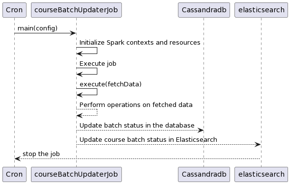

# Course Batch Status Updater Job

The course batch status updater job is used to update the status of course batches and update metadata in external systems like Elasticsearch and Neo4j. The status of the course batch is computed based on the start date and end date given during the course creation post it will be updated correctly with the help of this particular job which is scheduled to run on a daily basis at some predefined interval.

<figure><figcaption></figcaption></figure>

**Data provider:**\
\
**Elasticsearch**

course\_batch

**Cassandra**

course\_batch
