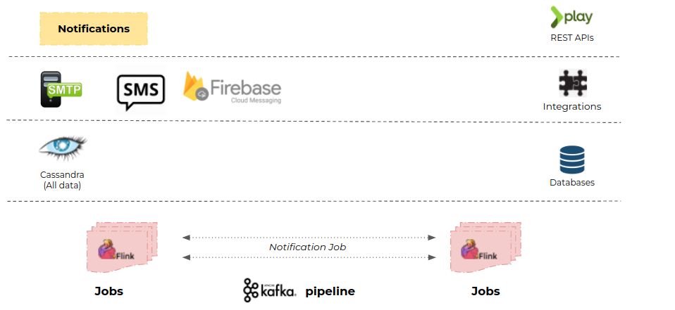
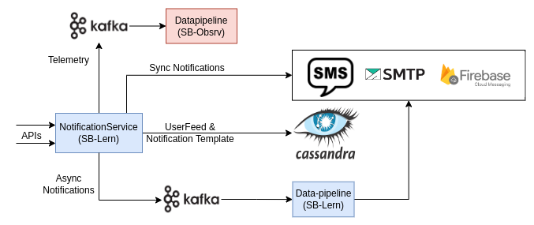

# Architecture

#### **Architecture Diagram:**

<figure><figcaption></figcaption></figure>

Flow Diagram:

<figure><figcaption></figcaption></figure>

Code Flow Diagram:

<figure><figcaption></figcaption></figure>

1. From Notification Service **Sync AP**I call is sent to the **SMS/email** provider at the same time **Async API** call is sent to the **Kafka cluster**.
2. If processing the notification is failed then the same message is pushed to the topic **Kafka** and then it is sent to **samza**.
3. From **samza** its finally sent to **lms-jobs(notification job)**.
