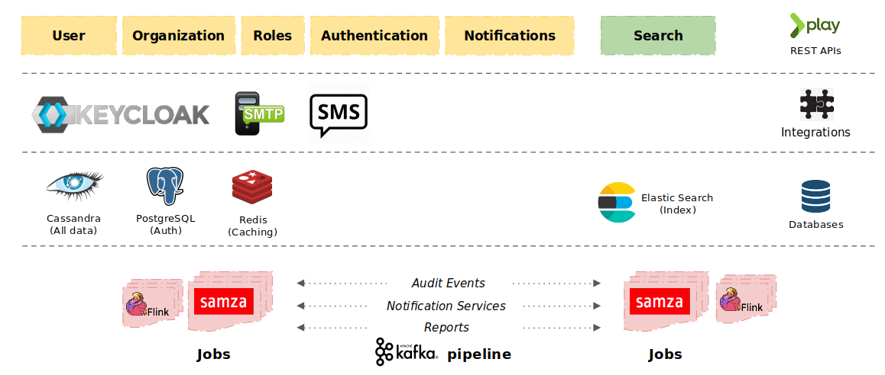

# Architecture

#### User\&Org Service Architecture Diagram

.png>)

* User service includes multiple operations to creating new users and search the user.
* Keyclock for user authentication.
* Enabled Notification feature and messaging like Email and SMS on any operations performed.
* Updation of user details using jobs.
* OTP Creations on user merge action.
* Admin Util will do token verification.
* Content service is for to register the channel and framework validation.
