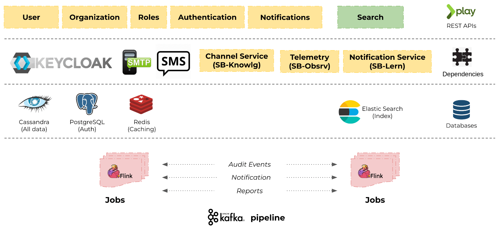

# Architecture

## UserOrg Service Architecture&#x20;

The below diagram represents the components involved and their arrangement in **UserOrg** service.

* The **UserOrg service** has build on play framework using akka actor.
* _**Cassandra**_ is a reference to Apache Cassandra, which is an open-source distributed NoSQL database. Cassandra is designed to handle large amounts of data across multiple servers while providing high availability and fault tolerance.
* _**Elasticsearch**_ is a distributed, open-source search and analytics engine. It is built on top of Apache Lucene, and it is designed to be scalable, fault-tolerant, and highly available. By leveraging _**Elasticsearch**_, we can deliver an efficient and robust search experience to our users, ensuring that our application performs exceptionally well and remains flexible to adapt to future needs.&#x20;
* _**Redis**_ is a popular open-source, in-memory data structure store often referred to as a "data structure server." It is designed for speed, efficiency, and versatility. _**Redis**_ stores data in RAM providing extremely fast read and write operations.
* By leveraging **Flink**, we enable real-time and batch data processing with low latency, high throughput, and fault tolerance.

<figure><figcaption>
Userorg Architecture
</figcaption></figure>

### Flow Diagram:

<figure><figcaption>
UserOrg Flow Diagram
</figcaption></figure>

* User service includes multiple operations to creating new users and search the user.
* Keyclock for user authentication.
* Enabled Notification feature and messaging like Email and SMS on any operations performed.
* Updation of user details using jobs.
* OTP Creations on user merge action.
* Admin Util will do token verification.
* Content service is for to register the channel and framework validation.
