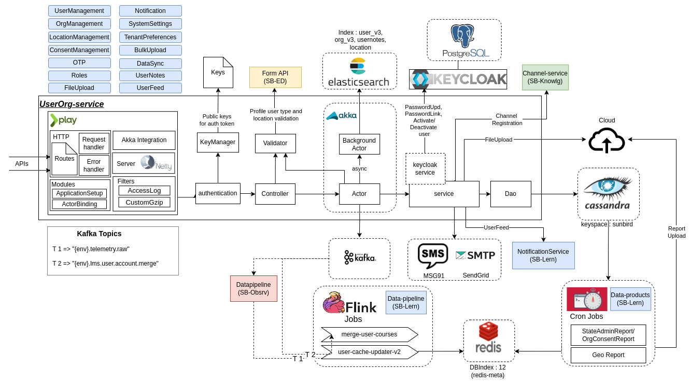

# Code Flow

The below diagram represents the code flow of **UserOrg** service.

<figure><figcaption></figcaption></figure>

### Repository

#### UserOrg Service


UserOrg Service


UserOrg Service APIs


UserOrg Service APIs


#### Flink Jobs


UserOrg data-popeline



UserOrg Flink Jobs


#### Reports


UserOrg data-product



UserOrg Reports

