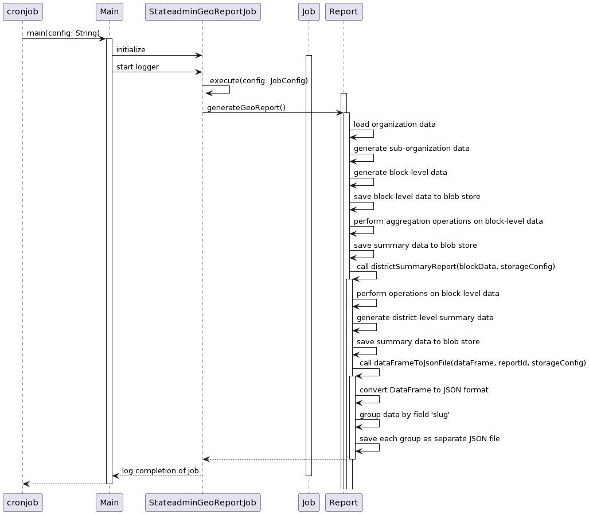

# State Admin Geo report

### **1. Geo-report:**

* geo-summary shows the number of schools, districts and blocks in a particular org.
* geo-summary-district shows the data with respect to district.

StateAdminGeoReportJob generates three folders in azure blob : geo-detail, geo-summary, geo-summary-district&#x20;

**geo-detail** contains csv reports with channel name and geo-summary, geo-summary-district contains json reports with channel name.

\
**geo-summary** shows the number of schools, districts and blocks in a particular org. Example: \[{"index":1,"districtName":"CHITTOOR","blocks":1,"schools":1}].

\
**geo-summary-district** provides the data with respect to district. Example: \[{"index":1,"districtName":"ARIYALUR","blocks":6,"schools":796},{"index":2,"districtName":"CHENNAI","blocks":10,"schools":1472},]\
\

<figure><figcaption></figcaption></figure>

\
**Data provider:**

**Cassandra**

1. organisation
2. location
3. user
