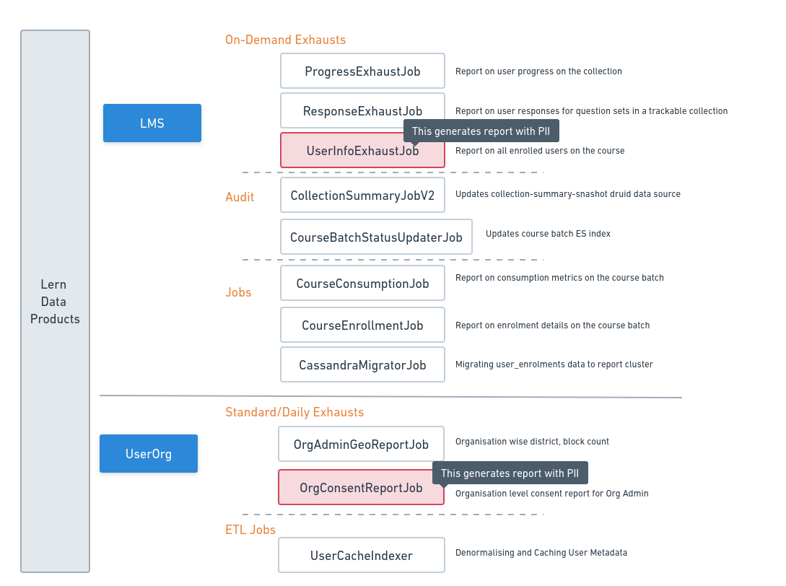

# Technical Architecture Diagram

**Microservices:** LERN BB provides the following services: - User-Org Service, LMS (Batch) Service, Groups Service, Notification Service and Discussion Forum&#x20;

**Dependencies:** LERN BB Microservices has dependencies on other BB microservices as well as intra-BB Services based. Individual micro-service architecture will provide the exact picture of dependcies of respective micro-service.&#x20;

**Databases:** LERN BB use Cassandra database as the primary database across its micro-services; Redis for data caching mechanism; Elasticsearch for enabling data search capabilities; Druid and Cloud Storage for reports generation and storage; And, Postgres for KC integration and for storing reports process information.&#x20;

**Jobs:** We have flink jobs that reads events from Kafka for processing data in the background to enable multiple functionalities.&#x20;

**Reports:** \<TBD>

<figure><figcaption>
Lern Technical Architecture
</figcaption></figure>

The diagram represents the components involved and their arrangement in **Lern**.

* **Services** has build on play framework using akka actor.
* _**Cassandra**_ is a reference to Apache Cassandra, which is an open-source distributed NoSQL database. Cassandra is designed to handle large amounts of data across multiple servers while providing high availability and fault tolerance.
* _**Elasticsearch**_ is a distributed, open-source search and analytics engine. It is built on top of Apache Lucene, and it is designed to be scalable, fault-tolerant, and highly available. By leveraging _**Elasticsearch**_, we can deliver an efficient and robust search experience to our users, ensuring that our application performs exceptionally well and remains flexible to adapt to future needs.&#x20;
* _**Redis**_ is a popular open-source, in-memory data structure store often referred to as a "data structure server." It is designed for speed, efficiency, and versatility. _**Redis**_ stores data in RAM providing extremely fast read and write operations.
* By leveraging **Flink**, we enable real-time and batch data processing with low latency, high throughput, and fault tolerance. Lern uses Flink jobs for asynchronous processes.&#x20;

### **Overall Architecture of Reports (Data Products):**

<figure><figcaption>
Data-Product Architecture
</figcaption></figure>

Reports (Data products) refer to products or services derived from data analysis or processing. They are typically created to provide valuable insights. Providing you with the list of data products available in the Sunbird platform below

<figure><figcaption></figcaption></figure>


Lern Highlevel Architecture

