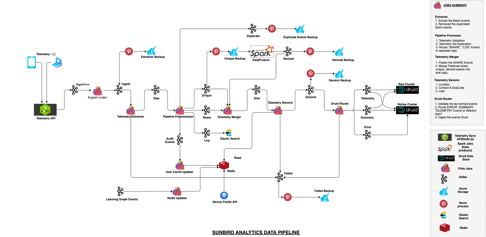

# Telemetry Processing

Telemetry from all the Lern Components are pushed in to Sunbird-Obsrv data-pipeline through "{env}.telemetry.raw" Kafka topic using Logstash.

Please refer the Subird-Obsrv documentation for more details:



Data-pipeline Flow Diagram:&#x20;

Lern services like UserOrg, LMS, Groups and Notification Service push the telemetry to Raw Kafka in below diagram, so telemetry extractor flink job and ingest router flink job does not come in to action. Those two jobs are application in case of UI components, where telemetry service API is called to push telemetry events.

<figure><figcaption></figcaption></figure>
