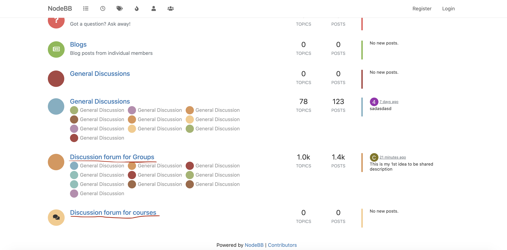
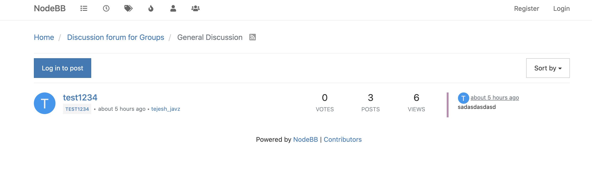

# Discussion forum integration with any application

Discussion forum is library and can be attached to any application. Before integrating we have to verify following things

* Application should maintain cache.
* Discussion forum uid have to be stored in cache.
* Uid need to attach for all discussion forum apis as a query param link `?_uid=${discussionForum_uid}`.

### Add discussion for a context <a href="#add-discussion-for-a-context" id="add-discussion-for-a-context"></a>

We can attach discussion forum for any context like Groups/Courses/Batchs/Textbooks…etc.

Before attaching discussion forum we have to create one parent category and for context have one parent category. So that we can have all group context under one parent similarly for course, textbook.

You can see below image. `Discussion forum for Groups` is a parent category and all group related discussion forums are under that category.

### **Prerequisite** <a href="#prerequisite" id="prerequisite"></a>

1. Redis should be up and running.
2. Local nodebb should be up and running.

### How to create Parent category (pid)

**Step:1**

Login to nodebb as a admin. And go to admin panel [http://localhost:4567/admin](http://localhost:4567/admin).

**Step:2**

We need to create a categories in Nodebb.

1. click on “Manage“ tab and select “Categories“
2. You can see “**+**“ icon at right side bottom, click on that, It will open a popup. Enter Category name and click on Save. It will create a category “**Covid 19 Guidelines”**

.png>)



**Step:3**

Click on **Discussion forum for groups,** You will category ID in url bar. Use that category id as a **PID.**

And update the form api by replacing the PID in payload.

```
POST: /data/v1/form/create 
```

```
{
  "request": {
    "type": "forum",
    "subType": "group",
    "action": "create",
    "data": {
      "templateName": "defaultTemplate",
      "action": "create",
      "fields": [
        {
          "category": {
            "name": "General Discussion",
            "pid": "30",
            "uid": "4",
            "description": "",
            "context": [
              {
                "type": "group",
                "identifier": "_groupId"
              }
            ]
          }
        }
      ]
    }
  }
}
```

**Step: 4**

Verify if the form api is updated or not by calling the below api.

```
POST: /data/v1/form/read 
```

**Payload**

```
{
    "request": {
        "type": "forum",
        "subType": "group",
        "action": "create"
    }
}
```

**Response**

```
{
    "id": "api.form.read",
    "params": {
        "resmsgid": "f18a1975-8d64-4590-b419-be495cd9d6c4",
        "msgid": "255e08db-2464-4edd-aab6-cbde4308f53e",
        "status": "successful"
    },
    "responseCode": "OK",
    "result": {
        "form": {
            "type": "forum",
            "subtype": "group",
            "action": "create",
            "component": "*",
            "framework": "*",
            "data": {
                "templateName": "defaultTemplate",
                "action": "create",
                "fields": [
                    {
                        "category": {
                            "name": "General Discussion",
                            "pid": "30",
                            "uid": "4",
                            "description": "",
                            "context": [
                                {
                                    "type": "group",
                                    "identifier": "_groupId"
                                }
                            ]
                        }
                    }
                ]
            },
            "created_on": "2021-02-15T05:33:03.734Z",
            "last_modified_on": "2021-02-15T09:52:41.820Z",
            "rootOrgId": "*"
        }
    },
    "ts": "2021-02-15T10:14:08.707Z",
    "ver": "1.0"
}
```

### **CURL for attaching discussion forum**

For example, We are adding discussion forum for group, For that we have to use below api.

**Request**

URL: `https://staging.sunbirded.org/discussion/forum/v3/create`

Payload:

```
{
  "category": {
    "name": "General Discussion", // Name of the category 
    "pid": "30", // parent category id, under this category we are creating new categories
    "description": "", // category description: Optional
    "context": [
      {
        "type": "group", // type as a group
        "identifier": "bc190919-f9a4-4e8a-a48b-2bba9c0b827f" // group Id
      }
    ]
  }
}
```

CURL

```
curl 'https://staging.sunbirded.org/discussion/forum/v3/create' \
  -H 'Connection: keep-alive' \
  -H 'sec-ch-ua: " Not;A Brand";v="99", "Google Chrome";v="97", "Chromium";v="97"' \
  -H 'X-App-Id: staging.sunbird.portal' \
  -H 'sec-ch-ua-mobile: ?0' \
  -H 'User-Agent: Mozilla/5.0 (Macintosh; Intel Mac OS X 10_15_7) AppleWebKit/537.36 (KHTML, like Gecko) Chrome/97.0.4692.71 Safari/537.36' \
  -H 'Content-Type: application/json' \
  -H 'Access-Control-Allow-Origin: *' \
  -H 'Accept: application/json' \
  -H 'X-Device-Id: 23b82f7e68c9974eb17af148415a6067' \
  -H 'X-Channel-Id: 0126796199493140480' \
  -H 'sec-ch-ua-platform: "macOS"' \
  -H 'Origin: https://staging.sunbirded.org' \
  -H 'Sec-Fetch-Site: same-origin' \
  -H 'Sec-Fetch-Mode: cors' \
  -H 'Sec-Fetch-Dest: empty' \
  -H 'Referer: https://staging.sunbirded.org/my-groups/group-details/bc190919-f9a4-4e8a-a48b-2bba9c0b827f' \
  -H 'Accept-Language: en-GB,en;q=0.9' \
  -H 'Cookie: connect.sid=s%3AS3j18UnlsjcbY4_kbWjfCdO7iBvR0h_G.1dWXH%2Ba%2BUZ3zyFN4JnK2ucdU9mFqkRfmiPJrTgxulPU' \
  --data-raw '{"category":{"name":"General Discussion","pid":"30","uid":"4","description":"","context":[{"type":"group","identifier":"bc190919-f9a4-4e8a-a48b-2bba9c0b827f"}]}}' \
  --compressed
```

**Response**

```
{
  "id": ".discussions.api.forum.v3.create",
  "ver": "1.0",
  "ets": 1642673148032,
  "params": {
    "resmsgid": "16ea8c5b-682c-4ac2-889e-d5896fc057fd",
    "msgid": "",
    "status": "Success"
  },
  "responseCode": "OK",
  "result": {
    "forums": [
      {
        "sbType": "group",
        "sbIdentifier": "bc190919-f9a4-4e8a-a48b-2bba9c0b827f",
        "newCid": 801, // New category created for group context 
        "cids": [801]
      }
    ]
  }
}
```

n the above response we have `newCid` that is the category id which is created for the group context that we pass in the request. So whet ever the discussions happened in the group are present in the discussion forum category.


