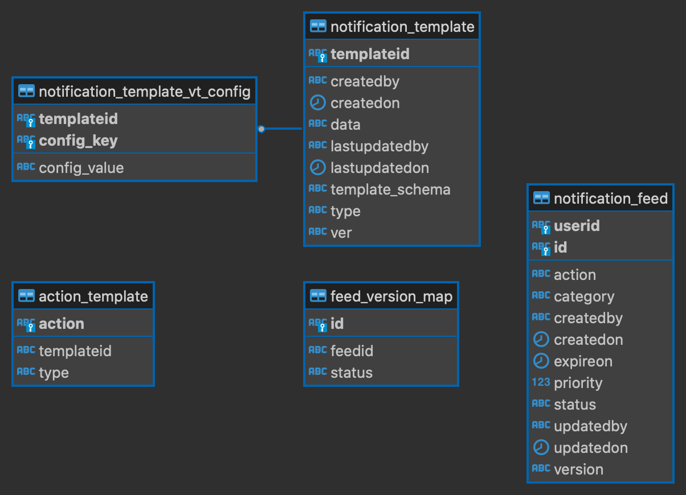

# Data Models

#### Schema Definition <a href="#schema-definition" id="schema-definition"></a>

**ER Diagram**



Contains the notification standard schema definition. Any notification event creation request should follow the same specs to create any notifications.

#### Notification Keyspace:

```
CREATE KEYSPACE IF NOT EXISTS sunbird_groups WITH replication = {'class':'SimpleStrategy','replication_factor':1};CREATE TABLE IF NOT EXISTS  sunbird.user(id text,userId text,userName text, email text,phone text,aadhaarNo text,createdDate text,updatedDate text,updatedBy text,
ode
```

#### Notification Table:

```
CREATE TABLE sunbird_notifications.notification_feed (
    id text ,
    createdby text,
    createdon timestamp,
    action text,                  //contains only params, additionalInfo, action type, createdBy
    expireon timestamp,
    priority int,
    status text,
    updatedby text,
    updatedon timestamp,
    userid text,
    version text,
    primary key(userid,id)
)
```

```
CREATE TABLE IF NOT EXISTS sunbird.notification_template(
templateId text,
lang text,
type text,                      //JSON,STRING, HTML, XML
ver text,                   
template text,
template_schema text,
createdOn timestamp,
lastUpdatedOn timestamp,
createdBy text,
lastUpdatedBy text,
PRIMARY KEY((templateId,language));
```

#### /notification/create <a href="#notification-create" id="notification-create"></a>

```
{
  "$schema": "http://json-schema.org/draft-07/schema#",
  "title" : "request",
  "type": "object",
  "required":["notifications"],
  "properties":{
     "notifications":{
       "$id":"#root/notifications",
       "title": "notifications",
       "type":"array",
       "items":{
           "$ref":"#/notification"
        }
     }
   }
}
```

```
{
  "$schema": "http://json-schema.org/draft-07/notification#", 
  "title": "notification", 
  "type": "object",
  "required": [
    "priority",
    "type",
    "action"
  ],
  "properties": {
    "ids": {
      "$id": "#root/ids", 
      "title": "ids", 
      "type": "array",
      "default": [],
      "items":{
        "$id": "#root/ids/items", 
        "title": "Items", 
        "type": "string"        
      }
    },
    "priority": {
      "$id": "#root/priority", 
      "title": "Priority", 
      "type": "integer"
    },
    "type": {
      "$id": "#root/type", 
      "title": "Type", 
      "type": "string",
      "enum": ["EMAIL", "SMS", "FCM", "FEED"]
    },
    "action": {
      "$id": "#root/action", 
      "title": "Action", 
      "type": "object",
      "required": [
        "type",
        "category",
        "createdBy"
      ],
      "properties": {
        "type": {
          "$id": "#root/action/type", 
          "title": "Type", 
          "type": "string"
        },
        "category": {
          "$id": "#root/action/category", 
          "title": "Category", 
          "type": "string"
        },
        "template": {
          "$id": "#root/action/template", 
          "title": "Template", 
          "type": "object",
          "required": [
            "params"
          ],
          "properties": {
            "id": {
              "$id": "#root/action/template/id", 
              "title": "Id", 
              "type": "string"
            },
            "type": {
              "$id": "#root/action/template/type", 
              "title": "Type", 
              "type": "string"
            },
            "data": {
              "$id": "#root/action/template/data", 
              "title": "Data", 
              "type": "string"
            },
            "ver": {
              "$id": "#root/action/template/ver", 
              "title": "Ver", 
              "type": "string"
            },
            "params": {
              "$ref": "#/definitions/mapString"
              "definitions": {
              "mapString": {
                 "type": "object",
                 "additionalProperties": {"type": "string"}
              }
             }            
           }
          }
        },
        "createdBy": {
          "$id": "#root/action/createdBy", 
          "title": "Createdby", 
          "type": "object",
          "required": [
            "id",
            "type"
          ],
          "properties": {
            "id": {
              "$id": "#root/action/createdBy/id", 
              "title": "Id", 
              "type": "string"
            },
            "name": {
              "$id": "#root/action/createdBy/name", 
              "title": "Name", 
              "type": "string"
            },
            "type": {
              "$id": "#root/action/createdBy/type", 
              "title": "Type", 
              "type": "string"
            }
          }
        },
        "additionalInfo": {
          "$id": "#root/action/additionalInfo", 
          "title": "Additionalinfo", 
          "type": "object",
          "properties": {
            
          {
    "id": "api.notification.feed.read.e79ee6a4-d79c-4236-9e05-f754010932d6",
    "ver": "v1",
    "ts": "2021-05-10 05:54:35:649+0000",
    "params": {
        "resmsgid": null,
        "msgid": "8470ecb7fa05d7d22313a30c9a16927d",
        "err": null,
        "status": "success",
        "errmsg": null
    },
    "responseCode": "OK",
    "result": {
        "response": {
            "userFeed": [
                {
                    "id": "ddab7b78-5978-4a11-b7f8-6594c7a6e7b8",
                    "userId": "e79ee6a4-d79c-4236-9e05-f754010932d6",                    
                    "priority": 1,
                    "createdBy": "e79ee6a4-d79c-4236-9e05-f754010932d6",
                    "status": "unread",  
                    "createdOn": 1620626043127,                                      
                    "action": {
                            "type": "add-member",
                            "category": "groups",
                            "template": {
                              "data": "{"title": "आपको Test group में जोड़ दिया गया है"}",
                              "type": "JSON",
                               "ver":  "4.2.0"
                            }, 
                            "createdBy":{
							    "id":"e79ee6a4-d79c-4236-9e05-f754010932d6",
							    "name":"John",
							    "type": "User"
			    				 },
                           "additionalInfo":{
                              
                    
                            }
                   ]
               }
         }
}
 },           
        }
      }
    }
  }
}
```

Detailed schema definition present in this Reference - [schema definition](https://project-sunbird.atlassian.net/wiki/spaces/UM/pages/2632613972/Notification+Design+Discussion)
