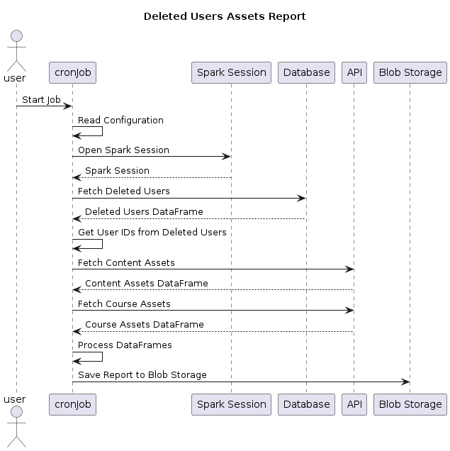

# Delete Users Assets Report

### The "Deleted Users Assets Report" provides an overview of assets (content and course assets) created by users who have been deleted from the system. The report involves the following steps:

1. **Fetch Deleted Users:** Retrieve a list of users who have been marked as deleted from the database.
2. **Extract User IDs:** Extract the unique identifiers for these deleted users.
3. **Fetch Content Assets:** Query an external API to fetch assets (such as documents, media, etc.) created by these deleted users.
4. **Fetch Course Assets:** Query an external API to fetch course-related assets (like course batches) associated with these deleted users.
5. **Process DataFrames:** Integrate the dataframes for deleted users and their assets, and perform necessary processing, such as filtering and deduplication.
6. **Save Report to Blob Storage:** Save the final processed report to a cloud-based blob storage, typically in CSV format.

This report is useful for auditing, tracking, and removing assets that are no longer needed, ensuring system cleanliness and compliance with data retention policies.\


<figure><figcaption></figcaption></figure>

\
**Data provider:**

* Cassandra - User table
* Course Batch API
* Content Search API

**Delete Asset report CSV content:**

| Column Label    | Column Type | Data Type | Description                                                         |
| --------------- | ----------- | --------- | ------------------------------------------------------------------- |
| userId          | Static      | String    | User Id of the deleted User                                         |
| username        | Static      | String    | Decrypted user name of the deleted user                             |
| roles           | Static      | String    | Roles of the deleted user                                           |
| assetIdentifier | Static      | String    | Identifier of the asset / course batch                              |
| assetName       | Static      | String    | Name of the asset / course batch                                    |
| assetStatus     | Static      | String    | Status of the asset / course batch i.e live/draft                   |
| objectType      | Static      | String    | Object type of the asset/course batch i.e QuestionSet/content/batch |

\
**Sample data:**

```
userId	username	roles	assetIdentifier	assetName	assetStatus	objectType
cc3220fe-ace3-4716-a3a4-4ed799740947 	TestUser1	ORG_ADMIN	do_11395143971887513612	Test SRK QuestionSet	Live	QuestionSet
ed8f22b1-1c33-4ca5-b8fd-572844ef3a7a 	Demouser	CONTENT_CREATOR	do_11395139703507353614	QuestionSet-FT-2014	Draft	QuestionSet
ed8f22b1-1c33-4ca5-b8fd-572844ef3a7a 	DeleteuserTest  BOOK_CREATOR    do_11395217540852940811 sameple course	        Live	Content
```
