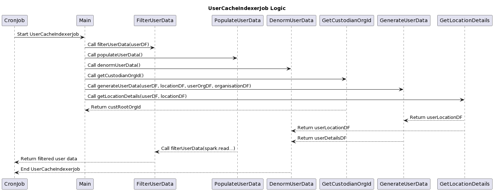

# User Cache Indexer Job

The User Cache Indexer job reads user data from Cassandra, performs transformations and joins, and stores the processed data in Redis for caching and indexing purposes.&#x20;

<figure><figcaption></figcaption></figure>

**Data provider:**

\
**Cassandra**

1. user
2. location

**User Redis**\
\
For more information please visit,\


[usercacheupdaterflinkjob.md](../../caching-and-denormalising-user-metadata/usercacheupdaterflinkjob.md)



[etlusercacheupdaterjob.md](../../caching-and-denormalising-user-metadata/etlusercacheupdaterjob.md)

