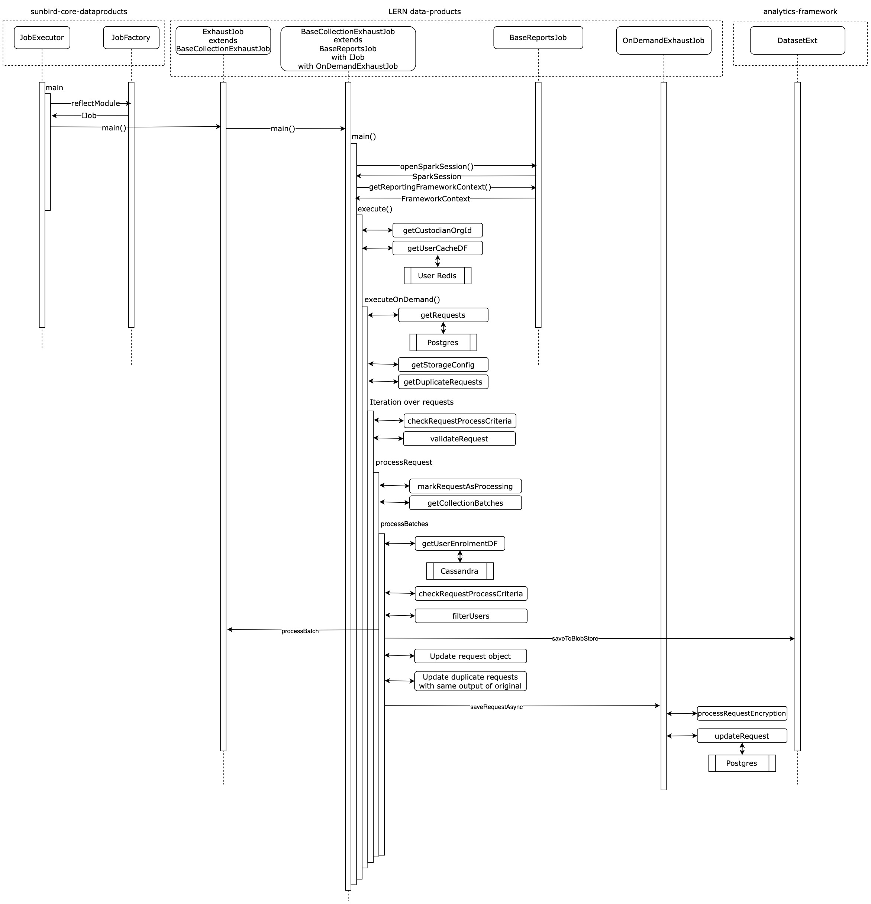

# Data-product creation guide

Each data-product is an independent spark job that runs in a spark-submit mode for generating reports and data migrations. So, even for a new data-product, we will have to add a new scala script with some class base classes extended.

### Data-product execution flow

<figure><figcaption>
Data-product tech level architecture
</figcaption></figure>

### Exhaust job execution flow

<figure><figcaption></figcaption></figure>

As mentioned in Data-product execution overflow, all the data-products are under the `JobExecutor` from sunbird-core-dataproducts. Thus, before creating a data-product, dependency libraries need to be setup.

Required Baseclasses a new Data-product:

*   `IJob`

    It is an abstract class in from sunbird-core-dataproducts which used to represent script as data-product job to the job manager
*   `BaseReportsJob`

    It has the spark utility functions such as creating a spark session for a data-product.

## Configurations

Data-product can be executed with following two levels of cofiguration.

### `application level config`

This config is provided from the `application.conf` file which is common for all the data-products and will not be modified frequently.

Github Path for the template which is used to create the `.conf` file:&#x20;



### `lern-model-config`

Each job is collecting data from different data-providers and has various types of inputs. So, model config is implemented to serve data-product level configuration

Github Path for the template which is used to create the model-config file:&#x20;



### Script changes for creating a new data-product

Since the data-product is a batch processing scripts, in server data-products are triggered using shell scripts. So whenever the data-product is implemented we need to add the job id and model-config in the below shell script templates.

`lern-run-job` : job-id which will be used as identifier and respective data-product classpath will be added in this scripts.



`lern-model-config` : Respective job id job config has to be added in the this script



