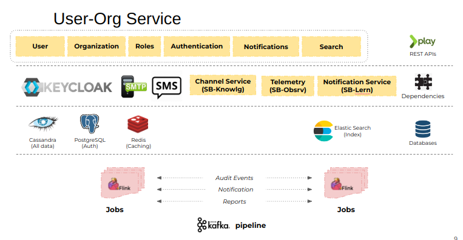

# Installation Guide

### How To Setup

This section describes how to install and start User\&Org Service and set up the default organisation & user creation. Prior to installation refer to [Tech Stack](tech-stack.md) and install the softwares.

#### Project setup:

Fork the below projects and clone it from git,

`git clone` [`https://github.com/project-sunbird/sunbird-lms-service`](https://github.com/project-sunbird/sunbird-lms-service) **(latest release branch)**

`git clone` [`https://github.com/project-sunbird/sunbird-utils`](https://github.com/project-sunbird/sunbird-utils)

Run,\
`mvn clean install -DskipTests` in[ sunbird-utils](https://github.com/project-sunbird/sunbird-utils) & in[ sunbird-lms-service](https://github.com/project-sunbird/sunbird-lms-service)

#### **Installation Configuration:**

User\&Org service requires few configurations to be set in properties file. Some of these properties can also be set as environment variables.

* Application functional configurations and dependency service configurations has to be mentioned in externalresource.properties file\
  \
  **\<Project base path>/sunbird-lms-service/core/platformcommon/src/main/resources/externalresource.properties**

#### Environment Variables Setup

Kindly check the latest environment properties file to ensure any new properties that needs to be added is configured. Refer [Installation Configuration](installation-guide.md#installation-configuration).

#### **Cassandra** **Migration**:

Before starting with migration please ensure to set the env variables In terminal, \
execute following commands for cassandra migration: \
\
`sudo docker exec -it sunbird_cassandra sh` \
`cqlsh -f /sunbird-lms-service/service/src/main/resources/cassandra.cql` \
\
Open a new Terminal In the path **\<Project base path>**/sunbird-utils,\
Run the below command,\
`mvn clean install -DskipTests`&#x20;

Make sure the build is **success** and then,\
open a new Terminal In the path, **\<Project base path>/sunbird-utils/sunbird-cassandra-migration/cassandra-migration**,\
Run below command,\
`mvn clean install -DskipTests` \
`mvn exec:java`

In the console see which migration version has failed and update the success flag to true for that version using below query, \
`update cassandra_migration_version set success = True where version='1.86';` //Give the failed version number in the query.

``\
``Once the migration is done successfully, check for the below success message,\
**sunbird is up to date. No migration necessary.** \
**Migration Completed at ==1672910353402**

<figure><figcaption><p>Migration successful message</p></figcaption></figure>

### Elastic Search:

Post installation, Elastic search needs to be setup with indices and mappings from [sunbird-utils](https://github.com/project-sunbird/sunbird-utils).

Pick all the indices and mappings from \*\* \*\*<mark style="color:green;">**sunbird-utils/sunbird-es-utils/src/main/resources**</mark> folders and create index and mapping using postman.

Create index and mapping mainly for **user, userfeed, usernotes, org,** and **location** JSON files.



PUT http://localhost:9200/\<indices\_name> Body : \<indices\_json\_content>

PUT http://localhost:9200/\<indices\_name>/\_mapping/\_doc Body : \<mapping\_json\_content>

After creating the indices and mappings, add respective org index to org\_alias (if using lms-service release-3.8.0 or above) and respective user index to user\_alias (if using lms-service release-3.7.0 or above)

Elastic search details need to be configured in elasticsearch.config.properties

**Steps to Deploy and Run user org service in your system:**\
****\
****1. Open a new command line terminal in your system in the path,\
**\<Project base path>/sunbird-lms-service** and fire the below command,\
`mvn clean install -DskipTests`\
``Please ensure the build is success before firing the below command, if the build is not success then the project might not be imported properly and there is some configuration issues, fix the same and rebuild until it is successful. Post release-5.1.0 just go to **application.conf** and make the flag **AuthenticationEnabled** as **false , t**his will enable you to access all API's locally by declaring you as anonymous.

2\. Then go to the path,\
**\<Project base path>/sunbird-lms-service/controller** and fire the below command,\
`mvn play2:run`

Once the Application started successfully Please check the health of all services to be true before proceeding further,

3\. To check the health status of service, Just hit the below url in your browser,\
[http://localhost:9000/health](http://localhost:9000/health) or run the below curl in your terminal.

```
 curl --location --request GET 'http://localhost:9000/health' \
--header 'Content-Type: application/json' \
--header 'Accept: application/json'
```

The response should be something as below showing all services is up and healthy,


```json
// Success response of a health check API.

{
    "id": "api.all.health",
    "ver": "health",
    "ts": "2023-01-05 11:41:06:735+0530",
    "params": {
        "resmsgid": "8a11b6c3-d0b5-41d9-852e-6ab9e3ec2968",
        "msgid": "8a11b6c3-d0b5-41d9-852e-6ab9e3ec2968",
        "err": null,
        "status": "SUCCESS",
        "errmsg": null
    },
    "responseCode": "OK",
    "result": {
        "response": {
            "checks": [
                {
                    "err": "",
                    "healthy": true,
                    "name": "Learner service",
                    "errmsg": ""
                },
                {
                    "err": "",
                    "healthy": true,
                    "name": "Actor service",
                    "errmsg": ""
                },
                {
                    "err": "",
                    "healthy": true,
                    "name": "Cassandra service",
                    "errmsg": ""
                },
                {
                    "err": "",
                    "healthy": true,
                    "name": "Elastic search service",
                    "errmsg": ""
                }
            ],
            "healthy": true,
            "name": "Complete health check api"
        }
    }
}
```


#### Pre-required Configuration to Make User/Org service Completely working:

Creating a new custodian/root organisation is mandatory. so please ensure you get a <mark style="color:green;">**200 OK**</mark> response after creation.

```json
// To create a new Organisation

{
    "request": {
        "orgName": "localrootorg",
        "channel": "Channel",
        "description": "Description",
        "externalId": "localrootorg",
        "email": "info@org.org",
        "isSSOEnabled": true,
        "organisationType": "school",
        "isTenant": true
    }
}
```

```json
// Curl command to create a new Organisation in your local system
// ensure both of your cassandra and es is up and running

curl --location --request POST 'localhost:9000/v1/org/create' \
--header 'Content-Type: application/json' \
--data-raw '{
    "request": {
        "orgName": "localrootorg",
        "channel": "Channel",
        "description": "Description",
        "externalId": "localrootorg",
        "email": "info@org.org",
        "isSSOEnabled": true,
        "organisationType": "school",
        "isTenant": true
    }
}'
```

\
Use below **request body/curl** to setup the pre-required system settings like **custodian channel**, **custodian org id** , **user profile config** and **org profile config.**Please ensure you get a <mark style="color:green;">**200 OK**</mark> response after creation.


```json
// to set custodian channel
//Here the "value" column is given as Channel which is to be replaced with the Channel id which was given from your respective system's ORG CREATE request
{
    "request": {
        "id": "custodianOrgChannel",
        "field": "custodianOrgChannel",
        "value": "Channel"
    }
}
```


```json
//curl command to set custodian channel in local
//Here the "value" column is given as Channel which is to be replaced with the Channel id which was given from your respective system's ORG CREATE request

curl --location --request POST 'localhost:9000/v1/system/settings/set' \
--header 'Content-Type: application/json' \
--data-raw '{
    "request": {
        "id": "custodianOrgChannel",
        "field": "custodianOrgChannel",
        "value": "Channel"
    }
}'
```


```json
// to set custodian org id
//Here the "value" column is given as 0137038836873134080 which is to be replaced with the id generated from your respective system's ORG CREATE response

{
    "request": {
        "id": "custodianOrgId",
        "field": "custodianOrgId",
        "value": "0137038836873134080"
    }
}
```



```json
//curl command to set custodian org id in local
//Here the "value" column is given as 0137038836873134080 which is to be replaced with the id generated from your local system's ORG CREATE response

curl --location --request POST 'localhost:9000/v1/system/settings/set' \
--header 'Content-Type: application/json' \
--data-raw '{
    "request": {
        "id": "custodianOrgId",
        "field": "custodianOrgId",
        "value": "0137038836873134080"
    }
}'
```



```json
// to set User Profile Config

{
    "request": {
        "id": "userProfileConfig",
        "field": "userProfileConfig",
        "value": "{\"fields\":[\"firstName\",\"lastName\",\"profileSummary\",\"avatar\",\"countryCode\",\"dob\",\"email\",\"gender\",\"grade\",\"language\",\"location\",\"phone\",\"subject\",\"userName\",\"webPages\",\"jobProfile\",\"address\",\"education\",\"skills\",\"badgeAssertions\"],\"publicFields\":[\"firstName\",\"lastName\",\"profileSummary\",\"userName\"],\"privateFields\":[\"email\",\"phone\"],\"csv\":{\"supportedColumns\":{\"NAME\":\"firstName\",\"MOBILE PHONE\":\"phone\",\"EMAIL\":\"email\",\"SCHOOL ID\":\"orgId\",\"USER_TYPE\":\"userType\",\"ROLES\":\"roles\",\"USER ID\":\"userId\",\"SCHOOL EXTERNAL ID\":\"orgExternalId\"},\"outputColumns\":{\"userId\":\"USER ID\",\"firstName\":\"NAME\",\"phone\":\"MOBILE PHONE\",\"email\":\"EMAIL\",\"orgId\":\"SCHOOL ID\",\"orgName\":\"SCHOOL NAME\",\"userType\":\"USER_TYPE\",\"orgExternalId\":\"SCHOOL EXTERNAL ID\"},\"outputColumnsOrder\":[\"userId\",\"firstName\",\"phone\",\"email\",\"organisationId\",\"orgName\",\"userType\",\"orgExternalId\"],\"mandatoryColumns\":[\"firstName\",\"userType\",\"roles\"]},\"read\":{\"excludedFields\":[\"avatar\",\"jobProfile\",\"address\",\"education\",\"webPages\",\"skills\"]},\"framework\":{\"fields\":[\"board\",\"gradeLevel\",\"medium\",\"subject\",\"id\"],\"mandatoryFields\":[\"id\"]}}"
    }
}
```



```json
//Curl command for setting the user profile configuration in local environment

curl --location --request POST 'localhost:9000/v1/system/settings/set' \
--header 'Content-Type: application/json' \
--data-raw '{
    "request": {
        "id": "userProfileConfig",
        "field": "userProfileConfig",
        "value": "{\"fields\":[\"firstName\",\"lastName\",\"profileSummary\",\"avatar\",\"countryCode\",\"dob\",\"email\",\"gender\",\"grade\",\"language\",\"location\",\"phone\",\"subject\",\"userName\",\"webPages\",\"jobProfile\",\"address\",\"education\",\"skills\",\"badgeAssertions\"],\"publicFields\":[\"firstName\",\"lastName\",\"profileSummary\",\"userName\"],\"privateFields\":[\"email\",\"phone\"],\"csv\":{\"supportedColumns\":{\"NAME\":\"firstName\",\"MOBILE PHONE\":\"phone\",\"EMAIL\":\"email\",\"SCHOOL ID\":\"orgId\",\"USER_TYPE\":\"userType\",\"ROLES\":\"roles\",\"USER ID\":\"userId\",\"SCHOOL EXTERNAL ID\":\"orgExternalId\"},\"outputColumns\":{\"userId\":\"USER ID\",\"firstName\":\"NAME\",\"phone\":\"MOBILE PHONE\",\"email\":\"EMAIL\",\"orgId\":\"SCHOOL ID\",\"orgName\":\"SCHOOL NAME\",\"userType\":\"USER_TYPE\",\"orgExternalId\":\"SCHOOL EXTERNAL ID\"},\"outputColumnsOrder\":[\"userId\",\"firstName\",\"phone\",\"email\",\"organisationId\",\"orgName\",\"userType\",\"orgExternalId\"],\"mandatoryColumns\":[\"firstName\",\"userType\",\"roles\"]},\"read\":{\"excludedFields\":[\"avatar\",\"jobProfile\",\"address\",\"education\",\"webPages\",\"skills\"]},\"framework\":{\"fields\":[\"board\",\"gradeLevel\",\"medium\",\"subject\",\"id\"],\"mandatoryFields\":[\"id\"]}}"
    }
}'
```



```json
// to set org profile config 

{
    "request": {
        "id": "orgProfileConfig",
        "field": "orgProfileConfig",
        "value": "{\"csv\":{\"supportedColumns\":{\"SCHOOL NAME\":\"orgName\",\"BLOCK CODE\":\"locationCode\",\"STATUS\":\"status\",\"SCHOOL ID\":\"organisationId\",\"EXTERNAL ID\":\"externalId\",\"DESCRIPTION\":\"description\",\"ORGANISATION TYPE\":\"organisationType\"}, \"outputColumns\": {\"organisationId\":\"SCHOOL ID\",\"orgName\":\"SCHOOL NAME\",\"locationCode\":\"BLOCK CODE\",\"locationName\":\"BLOCK NAME\",\"externalId\":\"EXTERNAL ID\",\"organisationType\":\"ORGANISATION TYPE\"}, \"outputColumnsOrder\":[\"organisationId\",\"orgName\",\"locationCode\", \"locationName\",\"externalId\",\"organisationType\"],\"mandatoryColumns\":[\"orgName\",\"locationCode\",\"status\",\"organisationType\"]}}"
    }
}
```



```json
//Curl command for setting the org profile configuration in local environment

curl --location --request POST 'localhost:9000/v1/system/settings/set' \
--header 'Content-Type: application/json' \
--data-raw '{
    "request": {
        "id": "orgProfileConfig",
        "field": "orgProfileConfig",
        "value": "{\"csv\":{\"supportedColumns\":{\"SCHOOL NAME\":\"orgName\",\"BLOCK CODE\":\"locationCode\",\"STATUS\":\"status\",\"SCHOOL ID\":\"organisationId\",\"EXTERNAL ID\":\"externalId\",\"DESCRIPTION\":\"description\",\"ORGANISATION cTYPE\":\"organisationType\"}, \"outputColumns\": {\"organisationId\":\"SCHOOL ID\",\"orgName\":\"SCHOOL NAME\",\"locationCode\":\"BLOCK CODE\",\"locationName\":\"BLOCK NAME\",\"externalId\":\"EXTERNAL ID\",\"organisationType\":\"ORGANISATION TYPE\"}, \"outputColumnsOrder\":[\"organisationId\",\"orgName\",\"locationCode\", \"locationName\",\"externalId\",\"organisationType\"],\"mandatoryColumns\":[\"orgName\",\"locationCode\",\"status\",\"organisationType\"]}}"
    }
}'
```



Once the setup done, create user using below APIs


